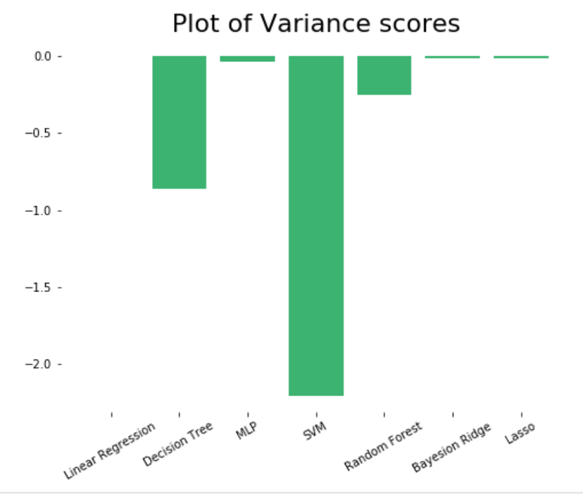

### Project Title

# Prediction of Forest Fires using the demographic and weather data of a forest.
Forest fire prediction constitutes a significant component of forest fire management. It plays a major role in resource allocation, mitigation, and recovery efforts. Here, I have done a detailed description and analysis of forest fire prediction methods based on Artificial Intelligence.

Here a novel forest fire risk prediction algorithm based on LASSO Regression, Support Vector Machines, Multi-Layer Perceptron (MLP), Linear Regression, Decision Tree, Random Forest, Bayesian Ridge, and Neural Networks are presented.

The algorithm depends on previous weather conditions like temperature, rain, burned area, day, and month of the year in order to predict the burned area

## Project structure
├── data\
│   └── forest_fires.csv\
├── Rishabh_16NA10019.ipynb\
├── Report.pdf\
├── images\
├── submissions\
├── requirements.txt\
└── License

### Prerequisites

```bash
pip install -r requirements.txt
```

### Usage

#### Variable definitions

-  X - x-axis spatial coordinate within the Montesinho park map: 1 to 9
-  Y - y-axis spatial coordinate within the Montesinho park map: 2 to 9
-  month - month of the year: "jan" to "dec"
-  day - day of the week: "mon" to "sun"
-  FFMC - FFMC index from the FWI system: 18.7 to 96.20
-  DMC - DMC index from the FWI system: 1.1 to 291.3
-  DC - DC index from the FWI system: 7.9 to 860.6
-  ISI - ISI index from the FWI system: 0.0 to 56.10
-  temp - temperature in Celsius degrees: 2.2 to 33.30
-  RH - relative humidity in %: 15.0 to 100
-  wind - wind speed in km/h: 0.40 to 9.40
-  rain - outside rain in mm/m2 : 0.0 to 6.4
-  area - the burned area of the forest (in ha): 0.00 to 1090.84

### Approach
I trained the model before and after normalizing the data. After training and visualizing the MSE error and variance on the initial data, I observed a huge error because of the fact that data is mostly skewed towards zero, which indicates that the model is not complex enough to learn the parameters(i.e., underfitting is occurring). Then after Normalizing the data, MSE error and variance are predicted and visualized again in the code.

I have visualized the effects of variation of a particular feature on forest fire and compared the loss of different models after training them.

Later I have also tried it using the classification approach by updating the prediction labels.



#### References :
https://github.com/ashutosh-ba/Forest-Fire-Regression/blob/master/README.md
https://www.researchgate.net/publication/261272818_Artificial_intelligence_for_forest_fire_prediction